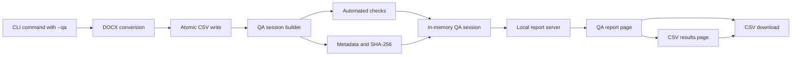

# DictFlow Quality Assurance System

**Technical White Sheet**  
Version 1.0 - August 2026

## Executive summary

The DictFlow quality assurance system is a local, CLI-initiated validation
layer for DOCX-to-CSV conversions. It evaluates the generated artifact against
the engine's technical output contract, creates a structured status report,
and presents both the report and converted CSV through a temporary browser
session.

The system is intended to answer four operational questions:

1. Was the generated file encoded and delimited correctly?
2. Does its schema and row count match the conversion result?
3. Are required dictionary fields populated and free from common rich-text
   artifacts?
4. When an image column exists, are populated image cells valid base64 image
   data URIs and are they encoded as WebP where expected?

QA is explicitly requested through the CLI. The CSV is written first, the
checks are then executed, and a local report server opens the results in the
default browser. The report remains available while the CLI process is
running.

## Objectives

The QA layer is designed around the following objectives:

- **Deterministic checks** - every status is derived from explicit rules rather
  than manual interpretation.
- **Immediate feedback** - operators receive visible CLI progress and a
  browser-readable result after conversion.
- **Artifact transparency** - the report exposes schema, row count, image
  count, sizes, processing time, and cryptographic fingerprints.
- **Data inspection** - the converted CSV can be reviewed in a paginated table
  without leaving the local report session.
- **Image visibility** - base64 image data URIs are rendered as thumbnails
  rather than displayed as long encoded strings.
- **Local operation** - the report binds to the loopback interface and does not
  require an external reporting service.

## Execution model

Run conversion and QA together:

```bash
python cli.py input.docx output.csv --qa
```

The output argument remains optional:

```bash
python cli.py input.docx --qa
```

The CLI presents three progress stages:

```text
[1/3] Converting input.docx...
[2/3] Running QA checks...
[3/3] Starting QA report server...
```

After startup, the terminal prints a local URL similar to:

```text
QA report: http://127.0.0.1:54321/qa
Press Ctrl+C to stop the QA report server.
```

The browser opens automatically by default. If automatic browser launch is not
desired, use:

```bash
python cli.py input.docx output.csv --qa --no-browser
```

The report server selects an available port automatically. A fixed local port
can be requested when required:

```bash
python cli.py input.docx output.csv --qa --qa-port 8765
```

The terminal process must remain active while the browser report is in use.
Pressing `Ctrl+C` closes the local report server but does not remove the CSV
that was already written.

## System architecture



The main components are:

| Component | Responsibility |
| --- | --- |
| `cli.py` | Orchestrates conversion, progress output, QA creation, and server startup |
| `app/qa.py` | Parses the generated CSV, runs checks, calculates metadata, and builds immutable report objects |
| `app/qa_server.py` | Starts the temporary local HTTP server and opens the browser |
| `app/qa_web.py` | Serves the report, paginated CSV preview, and CSV download |
| `qa_report.html` | Displays overall status, metrics, checks, and artifact fingerprints |
| `qa_csv.html` | Displays converted rows and image thumbnails |

## QA data model

The system uses three immutable data structures.

### QACheck

Each check contains:

- a human-readable name;
- a status: `pass`, `warning`, or `fail`; and
- details describing the observed result.

### QAReport

The report aggregates:

- input and output filenames;
- input and output sizes;
- row count;
- output columns;
- validated image-cell count;
- conversion duration;
- input SHA-256;
- output SHA-256;
- overall status; and
- the complete ordered list of checks.

### QASession

The session keeps the report, original conversion result, and parsed CSV rows
together in memory. The browser pages read from this single session, ensuring
that the report, preview, and downloaded artifact refer to the same conversion.

## Automated checks

### 1. UTF-8 BOM

The CSV must start with the three-byte UTF-8 byte-order mark:

```text
EF BB BF
```

| Result | Status |
| --- | --- |
| BOM is present | Pass |
| BOM is missing | Fail |

This verifies the `utf-8-sig` output contract used for spreadsheet
compatibility.

### 2. CRLF line endings

The generated CSV must contain CRLF (`\r\n`) row endings and must not contain a
line-feed character that is not preceded by a carriage return.

| Result | Status |
| --- | --- |
| Every row uses CRLF | Pass |
| Any non-CRLF row ending is found | Fail |

### 3. Tab-delimited schema

The QA parser decodes the file using `utf-8-sig` and reads it with a tab
delimiter. The parsed header order must match the conversion result, and the
number of parsed rows must match the recorded row count.

| Result | Status |
| --- | --- |
| Columns and row count match | Pass |
| Parsing fails or either value differs | Fail |

CSV image fields can be much larger than Python's default 128 KiB field limit.
Before parsing, the system increases the field limit to accommodate the current
artifact size. This prevents valid base64 images from being incorrectly treated
as missing data.

### 4. Required columns

The output must contain both `word` and `definition`.

| Result | Status |
| --- | --- |
| Both columns exist | Pass |
| Either column is missing | Fail |

The `image` column remains optional and is evaluated separately.

### 5. Data rows

At least one data row must be produced.

| Result | Status |
| --- | --- |
| One or more rows exist | Pass |
| No data rows exist | Fail |

### 6. Required cell completeness

Every parsed row is checked for nonempty `word` and `definition` values.

| Result | Status |
| --- | --- |
| Every required cell is populated | Pass |
| One or more required cells are empty | Warning |

The report provides separate counts for empty word cells and empty definition
cells. Empty required values are warnings because the CSV remains structurally
valid, but the dictionary content may require editorial review.

### 7. Plain-text output

The `word` and `definition` values are scanned for common rich-text HTML tags,
including bold, italic, span, mark, table, and list tags.

| Result | Status |
| --- | --- |
| No supported rich-text-like tags are found | Pass |
| One or more matching tags are found | Warning |

This is a targeted artifact check. It does not attempt to interpret every
possible angle-bracket sequence or determine whether HTML-like text was
intentionally authored as dictionary content.

### 8. Adaptive image output

Image behavior depends on whether the generated schema contains an `image`
column.

If the image column is absent:

| Result | Status |
| --- | --- |
| Adaptive output omits the image column | Pass |

If the image column is present, each populated image value must:

- begin with `data:image/`;
- include `;base64,`;
- contain syntactically valid base64; and
- preferably use the `data:image/webp;base64` media header.

| Result | Status |
| --- | --- |
| Every populated image is valid WebP base64 | Pass |
| The column exists but all image cells are empty | Warning |
| Every image is valid, but one or more use fallback formats | Warning |
| One or more populated cells are not valid base64 image data URIs | Fail |

The report's image count represents the number of valid populated image cells
in the CSV. It does **not** represent the number of unique media files stored
inside the DOCX package. A single embedded image may be referenced by multiple
rows, so these numbers can legitimately differ.

## Overall status model

Individual checks are combined into one report status:

| Condition | Overall status |
| --- | --- |
| At least one check fails | `FAILED` |
| No failures and at least one warning | `PASSED WITH WARNINGS` |
| Every check passes | `PASSED` |

A warning does not invalidate the file format. It identifies content that can
be parsed but may require human review. A failed status indicates that one or
more technical output requirements were not satisfied.

QA does not roll back or delete the CSV. The artifact is written before checks
are executed so that operators can inspect the exact file associated with a
warning or failure.

## Browser report

The first browser page displays:

- overall status;
- row, column, and image counts;
- conversion duration;
- pass, warning, and failure totals;
- every automated check and its details;
- input and output sizes;
- input and output SHA-256 fingerprints;
- a CSV download action; and
- navigation to the converted CSV results.

SHA-256 values identify the exact input and output artifacts used in the
session. They are fingerprints, not comparisons against an approved reference
file.

## CSV results page

Selecting **View CSV results** opens the converted data in the same browser tab.
The page:

- preserves output column order;
- displays row numbers;
- renders valid image data URIs as lazy-loaded thumbnails;
- displays ordinary values as escaped text;
- shows 50 rows per page;
- provides Previous and Next pagination; and
- provides access to the complete CSV download.

Pagination limits the amount of base64 image data rendered in a single browser
response. All parsed rows remain available across the page sequence.

## Local server and data handling

The report server binds to `127.0.0.1`, making it reachable from the local
machine rather than a public network interface. Unless a fixed port is
requested, the operating system selects an available port.

The report session is stored in application memory. It is not written as a
standalone HTML report and does not survive process termination. When the CLI
is stopped:

- the browser report URL becomes unavailable;
- the in-memory report and preview session are discarded; and
- the previously written CSV remains on disk.

QA routes return HTTP 404 when no valid in-memory QA session has been provided.
Report pages and downloads use no-store cache directives. The application's
security headers continue to restrict framing, content types, referrers,
scripts, forms, and image sources.

## Automated test coverage

Repository tests cover the principal QA behaviors:

- building a fully passing report;
- counting valid images;
- parsing base64 fields larger than the default Python CSV limit;
- rendering report and CSV pages from the same session;
- displaying converted text and image data;
- downloading the exact conversion bytes;
- hiding QA routes when no session exists;
- invoking QA through the CLI;
- emitting visible CLI progress; and
- handing the completed session to the local report server.

The broader conversion tests also exercise DOCX files with and without images,
formatting removal, invalid packages, missing dictionary tables, and web upload
behavior.

## Interpretation workflow

A recommended operator workflow is:

1. run the CLI with `--qa`;
2. wait for all three progress stages;
3. confirm the overall report status;
4. review every warning or failure detail;
5. compare row and image counts with expectations for the source document;
6. open **View CSV results**;
7. inspect representative rows across all result pages;
8. verify text alignment and image relevance manually;
9. download or retain the generated CSV; and
10. stop the local report server with `Ctrl+C`.

An overall `PASSED` status confirms the implemented technical rules. It does
not remove the need for domain review when dictionary meaning, spelling, image
relevance, or editorial quality is important.

## Current limitations

The current QA system does not automatically verify:

- semantic correctness of words or definitions;
- spelling, grammar, or editorial style;
- whether each image visually matches its dictionary word;
- binary image decodability beyond the current data-URI and base64 checks;
- equality between DOCX media-file count and CSV image-cell count;
- duplicate words or duplicate rows;
- ordering against an external canonical dictionary;
- expected output against a golden reference CSV;
- fixed performance or memory thresholds;
- cross-browser rendering in every environment;
- historical comparison between conversion runs; or
- persistent, signed, or externally published reports.

These limitations distinguish structural automation from semantic and visual
approval.

## Future directions

Potential extensions include:

- golden-file comparison against approved CSV outputs;
- duplicate word and duplicate row detection;
- configurable required-cell policies;
- image decoding, dimensions, and corruption checks;
- source-to-output image relationship reconciliation;
- semantic dictionary rules and controlled vocabularies;
- configurable performance thresholds;
- machine-readable JSON report export;
- persistent timestamped HTML reports;
- comparison between software versions or conversion runs; and
- CI integration with explicit pass/fail exit behavior.

## Conclusion

The DictFlow QA system provides a reproducible technical review of every
CLI-requested conversion. It validates encoding, line endings, schema, row
integrity, required content, plain-text output, and adaptive image data; records
artifact metadata and fingerprints; and presents the exact result through a
local two-page browser workflow. Its status model makes technical failures and
editorial warnings immediately visible while preserving the generated CSV for
inspection and downstream use.
