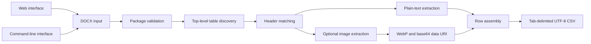

# DictFlow: DOCX Dictionary to CSV Automation Engine

**Technical White Sheet**  
Version 1.0 - August 2026

## Executive summary

DictFlow is a Python automation engine that converts dictionary tables stored
in Microsoft Word `.docx` files into structured, tab-delimited `.csv` files.
It replaces notebook-based and manually operated conversion workflows with a
reusable conversion core that can be invoked through either a browser page or
a command-line interface.

The engine is designed around a narrow and deterministic dictionary schema:
`word` and `definition` are required, while `image` is optional. When an image
column is present, embedded images are converted to WebP and stored as base64
data URIs. When it is absent, the output automatically contains only the two
required text columns.

The resulting file uses a `.csv` extension for compatibility with downstream
workflows, but its delimiter is a tab character (`\t`). The encoding is UTF-8
with a byte-order mark, and rows use CRLF line endings.

## Problem statement

Dictionary content is often authored in Word because it provides a familiar
editor for text and images. Word documents, however, are not directly suitable
for database ingestion, application imports, or repeatable data-processing
pipelines. Manual copying introduces several risks:

- inconsistent output columns;
- missed or duplicated rows;
- damaged Unicode text;
- image loss or inconsistent image formats;
- formatting artifacts leaking into data;
- reliance on notebook cells or developer-specific environments; and
- limited repeatability across documents and operators.

DictFlow addresses these risks by defining a stable input contract, applying a
deterministic extraction process, and producing a predictable machine-readable
artifact.

## Design objectives

The engine is built around the following objectives:

1. **Deterministic conversion** - the same supported DOCX content produces the
   same column structure and equivalent CSV data.
2. **Adaptive image support** - documents with and without an image column use
   the same conversion workflow.
3. **Plain-text normalization** - visual Word formatting does not become part
   of dictionary text.
4. **Operational flexibility** - nontechnical users can use the browser page,
   while automation workflows can use the CLI.
5. **Safe document handling** - malformed or excessively expanded DOCX
   packages are rejected before full parsing.
6. **Portable output** - Unicode text and embedded images remain self-contained
   in a single tab-delimited file.

## Input contract

The input must be a valid Office Open XML `.docx` package containing at least
one top-level table with the required headers.

| Header | Requirement | Output behavior |
| --- | --- | --- |
| `word` | Required | Extracted as normalized plain text |
| `definition` | Required | Extracted as normalized plain text |
| `image` | Optional | Included only when the header exists |

Header matching is case-insensitive and ignores repeated or surrounding
whitespace. For example, ` Word `, `WORD`, and `word` are treated as the same
header.

If multiple top-level tables match, the engine prefers a table containing the
optional `image` header. When candidates have the same priority, the earliest
matching table in the document is selected.

## Output contract

DictFlow produces a tab-delimited file with the following properties:

| Property | Value |
| --- | --- |
| File extension | `.csv` |
| Delimiter | Tab (`\t`) |
| Encoding | UTF-8 with BOM (`utf-8-sig`) |
| Line ending | CRLF (`\r\n`) |
| Quoting | CSV minimal quoting with double quotes |
| Index column | Not included |

The output schema is adaptive:

```text
word<TAB>definition
```

or:

```text
word<TAB>definition<TAB>image
```

Rows that are completely empty after extraction are omitted. Individual empty
cells remain empty so that column alignment is preserved.

## Conversion architecture



The conversion core is independent of the delivery surface. Both the web
application and CLI call the same `convert_dictionary_docx_to_csv()` function, ensuring that they
apply the same table selection, text extraction, image processing, and output
serialization rules.

## Document validation

A DOCX file is a ZIP package containing XML documents, relationships, media,
and metadata. Before `python-docx` parses the file, DictFlow performs structural
checks on an in-memory copy:

- the upload must not be empty;
- the package must be a readable ZIP archive;
- `[Content_Types].xml` must exist;
- `word/document.xml` must exist;
- the package may contain at most 10,000 internal members; and
- total uncompressed content may not exceed 250 MiB.

These checks reduce exposure to corrupted packages and decompression-based
resource exhaustion.

## Text extraction

Text is read from direct paragraphs within each selected table cell. Repeated
whitespace, tabs, and line breaks are normalized to single spaces. Paragraphs
inside a cell are joined in document order.

The output does not preserve presentation-oriented Word features, including:

- bold, italic, underline, color, or font size;
- text highlighting;
- bullet and numbering markers;
- paragraph indentation;
- nested list structure; or
- nested table content.

This behavior is intentional: `word` and `definition` are treated as data
fields rather than rich-text documents. Ordinary Unicode characters remain
part of the text because they are content, not Word formatting.

## Image processing

Image processing is activated only when the selected table contains an `image`
header. For every data row, the engine locates the first embedded image
relationship within the corresponding cell.

The standard processing path is:

1. read the embedded image bytes;
2. apply EXIF orientation correction;
3. normalize the image mode to RGB or RGBA;
4. encode the image as WebP using quality 75 by default;
5. base64-encode the WebP bytes; and
6. store the result as `data:image/webp;base64,...`.

The CLI accepts an image-quality value from 1 to 100. If Pillow cannot decode
or convert a supported embedded image, the original bytes are preserved as a
base64 data URI using their original content type. An image cell without an
embedded image falls back to its plain-text content, if any.

Base64 makes the output self-contained but increases file size. Documents with
many or large images can therefore produce CSV files substantially larger than
their text-only equivalents.

## Web interface

The Flask web interface provides a minimal single-button workflow:

1. select a `.docx` file;
2. conversion starts automatically;
3. the result is returned as a browser download; and
4. a short completion message reports the number of converted rows.

The browser upload is processed in memory and is not intentionally persisted
by the application. The default maximum request size is 25 MiB and can be
changed through the `MAX_UPLOAD_BYTES` environment variable.

Primary HTTP routes are:

| Route | Method | Purpose |
| --- | --- | --- |
| `/` | GET | Render the conversion page |
| `/convert` | POST | Accept a DOCX and return the converted CSV |
| `/health` | GET | Return a lightweight service health response |

Invalid extensions return a client error, unreadable DOCX packages return a
conversion error, and oversized requests return HTTP 413.

## Command-line interface

The CLI supports local use, shell scripts, scheduled jobs, and larger
automation pipelines.

Explicit output path:

```bash
python cli.py input.docx output.csv
```

Automatic output path next to the input:

```bash
python cli.py input.docx
```

Custom WebP quality:

```bash
python cli.py input.docx output.csv --image-quality 85
```

Paths containing spaces should be quoted. The CLI validates extensions and
paths before conversion. Output is first written to a temporary sibling file,
flushed to disk, and atomically moved into place. This prevents a partially
written target file if a filesystem operation fails.

## Security and reliability controls

DictFlow includes controls at the package, application, and response layers:

- upload size enforcement;
- DOCX ZIP structure and decompressed-size validation;
- sanitized browser-upload filenames;
- no-store cache directives for generated downloads;
- `X-Content-Type-Options: nosniff`;
- `X-Frame-Options: DENY`;
- restrictive referrer policy;
- Content Security Policy limiting scripts, styles, forms, frames, and image
  sources;
- user-facing conversion errors without raw stack traces; and
- atomic CLI output writes.

For public deployment, TLS termination and request filtering should be handled
by an HTTPS reverse proxy in front of the WSGI server.

## Runtime and deployment

DictFlow requires Python 3.9 or newer and uses a compact dependency set:

| Dependency | Responsibility |
| --- | --- |
| Flask | Web application and HTTP responses |
| Gunicorn | Production WSGI process management |
| python-docx | DOCX document and table access |
| Pillow | Image decoding, orientation, and WebP conversion |

Local startup:

```bash
python3 -m venv .venv
.venv/bin/python -m pip install -r requirements.txt
.venv/bin/python wsgi.py
```

Production startup example:

```bash
.venv/bin/gunicorn --workers 2 --bind 0.0.0.0:8000 --access-logfile - wsgi:app
```

Worker count and request limits should be selected according to document size,
image volume, available memory, and expected concurrency. Conversion is
memory-oriented, so every simultaneous large document increases process memory
usage.

## Operational characteristics

The engine is stateless for ordinary browser conversions. This simplifies
horizontal scaling because a conversion request does not depend on a previous
request. CLI conversion is also self-contained and does not require a running
web server.

Important operational considerations include:

- image-heavy documents consume more CPU during WebP encoding;
- base64 images increase output memory and storage requirements;
- large DOCX files are copied into memory before parsing;
- synchronous WSGI workers process one active request at a time; and
- reverse-proxy timeouts must allow sufficient time for large conversions.

## Current limitations

The current contract intentionally does not provide:

- support for legacy `.doc`, macro-enabled `.docm`, or non-Word input;
- configurable required header names;
- extraction of multiple dictionary tables into one output;
- preservation of Word rich text or list structure;
- extraction of nested table content;
- more than the first embedded image per image cell;
- streaming conversion of DOCX rows or images; or
- external object storage for image assets.

These constraints keep the conversion behavior narrow, predictable, and
compatible with the target dictionary-import workflow.

## Future directions

Potential extensions can be added without changing the core contract:

- configurable header aliases and output schemas;
- batch conversion of multiple DOCX files;
- an authenticated HTTP API;
- asynchronous job execution for very large documents;
- optional external image storage instead of base64;
- configurable image dimensions and compression policies;
- structured conversion metrics and centralized logging; and
- containerized deployment templates.

## Conclusion

DictFlow turns a Word-based dictionary authoring format into a stable import
artifact through one shared Python conversion engine. Its adaptive schema,
plain-text normalization, self-contained image representation, browser and CLI
interfaces, and package-level safeguards make it suitable as the foundation of
a repeatable dictionary content-processing workflow.
